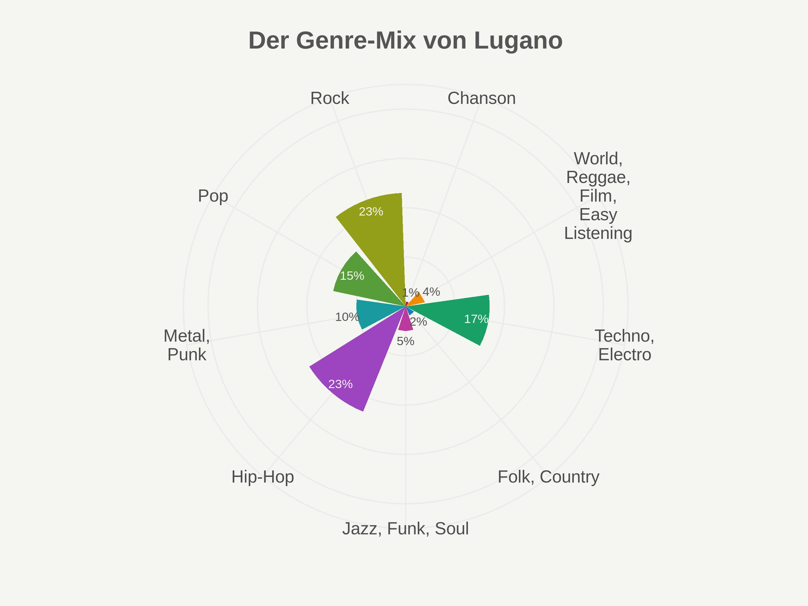
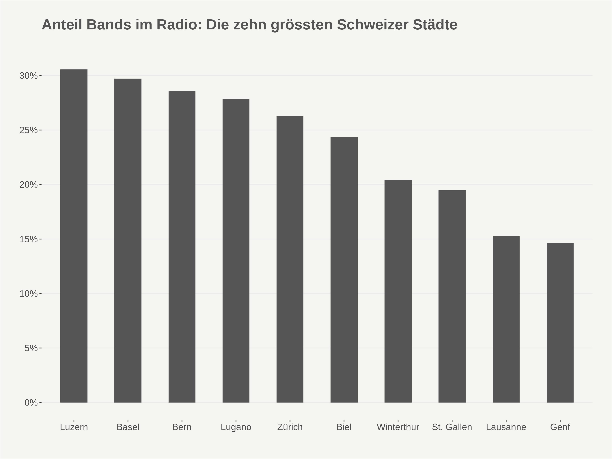

```{r, echo=FALSE}
project_name <- "2017-11-bands" # normalerweise im Format `r project_name`
r_version <- "3.4.2"
```

## Vorbemerkungen

Dieses Dokument beschreibt die Vorprozessierung und explorative Analyse des Datensatzes, der Grundlage des auf srf.ch veröffentlichten Artikel [Wo die Bandschmieden der Schweiz liegen](http://www.srf.ch/data) ist.

SRF Data legt Wert darauf, dass die Datenvorprozessierung und -Analyse nachvollzogen und überprüft werden kann. SRF Data glaubt an das Prinzip offener Daten, aber auch offener und nachvollziehbarer Methoden. Zum anderen soll es Dritten ermöglicht werden, auf dieser Vorarbeit aufzubauen und damit weitere Auswertungen oder Applikationen zu generieren.

Als Basis für die folgenden Auswertungen dienen Daten der Musikplattform Mx3.ch. Die vorliegenden Daten wurden von der öffentlichen API der SRG SSR abgerufen.

Die Endprodukte des vorliegenden Scripts, neben der vorliegenden explorativen Analyse, sind die entsprechenden Tabellen und Plots, die im Ordner `output` gespeichert werden (Datenbeschreibung siehe unten):

* `banddichte_kantone.csv`: Bands pro tausend Einwohner je Kanton (AR und AI zusammengefasst).
* `kulturförderung_banddichte.jpg`: Scatterplot von Banddichte und Kantonale Kulturausgaben.
* `city_broadcast_ratio.jpg`: Anteil an Bands im Radio der zehn grössten Schweizer Städte.
* `genre-mix_Basel.jpg`: Genre Mix in Prozent für die Stadt Basel.
* `genre-mix_Genf.jpg`: Genre Mix in Prozent für die Stadt Genf.
* `genre-mix_Lugano.jpg`: Genre Mix in Prozent für die Stadt Lugano.
* `genre-mix_Luzern.jpg`: Genre Mix in Prozent für die Stadt Luzern.
* `genre-mix_Zürich.jpg`: Genre Mix in Prozent für die Stadt Zürich.

### R-Script & Daten

Die Vorprozessierung und Analyse wurde im Statistikprogramm R vorgenommen. Das zugrunde liegende Script sowie die prozessierten Daten können unter [diesem Link](https://srfdata.github.io/`r project_name`/rscript.zip) heruntergeladen werden. Durch Ausführen von `main.Rmd` kann der hier beschriebene Prozess nachvollzogen und der für den Artikel verwendete Datensatz generiert werden. Dabei werden Daten aus dem Ordner `input` eingelesen und Ergebnisse in den Ordner `output` geschrieben. 

Verwendet wird **R Version `r r_version`**. Wenn der Code nicht funktioniert, könnte es daran liegen, dass die installierte R Version eine ältere ist und deshalb aus Kompatibilitätsgründen ältere Packages installiert werden, als die von uns verwendeten. Manchmal hilft es, das Skript mehrmals auszuführen, wenn ein Fehler auftritt. Besonders bei Package-Installationsproblemen kann es helfen, die R-Session mehrmals neuzustarten und den Code nochmals auszuführen. Allenfalls müssen noch Third-Party-Libraries wie z.B. `libgdal-dev` installiert werden.

### GitHub

Der Code für die vorliegende Datenprozessierung ist auf [https://github.com/srfdata/`r project_name`](https://github.com/srfdata/`r project_name`) zur freien Verwendung verfügbar. 

### Lizenz

<a rel="license" href="http://creativecommons.org/licenses/by-sa/4.0/"></a><br /><span xmlns:dct="http://purl.org/dc/terms/" href="http://purl.org/dc/dcmitype/Dataset" property="dct:title" rel="dct:type">`r project_name`</span> von <a xmlns:cc="http://creativecommons.org/ns#" href="https://github.com/srfdata/`r project_name`" property="cc:attributionName" rel="cc:attributionURL">SRF Data</a> ist lizenziert unter einer <a rel="license" href="http://creativecommons.org/licenses/by-sa/4.0/">Creative Commons Namensnennung - Weitergabe unter gleichen Bedingungen 4.0 International Lizenz</a>.

### Weitere Projekte

Code & Daten von [SRF Data](http://srf.ch/data) sind unter [http://srfdata.github.io](http://srfdata.github.io) verfügbar.

### Haftungsausschluss

Die veröffentlichten Informationen sind sorgfältig zusammengestellt, erheben aber keinen Anspruch auf Aktualität, Vollständigkeit oder Richtigkeit. Es wird keine Haftung übernommen für Schäden, die  durch die Verwendung dieses Scripts oder der daraus gezogenen Informationen entstehen. Dies gilt ebenfalls für Inhalte Dritter, die über dieses Angebot zugänglich sind.

### Datenbeschreibung 

#### Originalquellen

##### Mx3.ch

In der spezifischen API von [Mx3.ch](https://api.srgssr.ch/mx3-ch/apis) können die Band-Daten über die Band-ID durch den GET-Request «band-id-get» bezogen werden. Die Daten liegen im XML Format vor und müssen vor der Prozessierung mit R geparsed werden. Dieser Schritt kann ebenfalls mit R und den entsprechenden Packages (`httr`, `jsonlite`, `purrr`) implementiert werden, ist aber hier nicht näher dokumentiert. Weiterführende Informationen zur API können der [API-Dokumentation von Mx3.ch](http://www.srgssr.ch/fileadmin/pdfs/mx3-api-documentation-5.pdf) entnommen werden.

###### `input/band_data_raw.csv` (aus XML geparste Band-Daten von Mx3.ch)

| Attribut | Typ | Beschreibung |
|-------|------|-----------------------------------------------------------------------------|
| id | int | Identifikationsnummer, einmalig je Band |
| name | Factor | Bandname |
| created_at | Factor | Datum und Uhrzeit der Profilerstellung |
| city  | Factor | Andgabe der Stadt (kein Pflichtfeld) |
| profile_views_count | int | Anzahl Profilaufrufe bis zum Stichtag |
| playlist_count | in | Anzahl Songs in auf Mx3.ch erstellten Playlists |
| categories.id | int | Identifikationsnummer des Genres |
| categories.name | Factor | Genre-Name gemäss Mx3.ch |
| state.name | Factor | Kantonsname |
| state.code | Factor | Kantonskürzel |
| listening_count | int | Anzahl Plays über alle Songs auf einem Bandprofil |
| listening_count_last_period | int | Anzahl Plays in spez. Zeitraum |
| is_broadcasted | logi | TRUE: wurde mindestens einmal auf einem Mx3-Radiosender gespielt / FALSE: wurde nie gespielt |
| singles_count | int | Anzahl Songs auf dem Bandprofil |

##### Kulturausgaben der Kantone und ihrer Gemeinden sowie Beiträge der Lotterien an die Kultur

Die Daten des BFS zur [öffentlichen Kulturfinanzierung](https://www.bfs.admin.ch/bfs/de/home/statistiken/kultur-medien-informationsgesellschaft-sport/kultur/kulturfinanzierung/oeffentliche.assetdetail.1440496.html) wurden für die Jahre 2008 - 2014 gemittelt, da die Abweichungen innerhalb einzelner Jahre teilweise gross sind. Anschliessend wurden die gemittelten Kulturausgaben anhand der Einwohnerzahlen aus dem Jahr 2015 an den Einwohnerzahlen der Kantone normalisiert, um Pro-Kopf-Ausgaben zu erhalten. 

#### Ausgewählte Indikatoren im regionalen Vergleich, 2017

Die Daten zu den Kantonalen Einwohnerzahlen des BFS wurden den [Ausgewählten Indikatoren im regionalen Vergleich, 2017](https://www.bfs.admin.ch/asset/de/je-d-21.03.02) entnommen und zeigen den Stand von 2015 auf. Anhand dieser Bevölkerungszahlen wurden die Anzahl Bands und die Kulturförderungsausgaben normalisiert.

## Vorbereitungen

```{r preparations, echo=FALSE}
detach_all_packages <- function() {
  basic_packages_blank <-  c("stats",
                             "graphics",
                             "grDevices",
                             "utils",
                             "datasets",
                             "methods",
                             "base")
  basic_packages <- paste("package:", basic_packages_blank, sep = "")

  package_list <- search()[
    ifelse(unlist(gregexpr("package:", search())) == 1, TRUE, FALSE)]

  package_list <- setdiff(package_list, basic_packages)

  if (length(package_list) > 0)  for (package in package_list) {
    detach(package, character.only = TRUE, unload = TRUE)
    print(paste("package ", package, " detached", sep = ""))
  }
}

detach_all_packages()
source("scripts/csf.R")
path_to_wd <- csf() # if this - for some reason - does not work,
# replace with a hardcoded path, like so: "~/projects/rddj-template/analysis/"
if ( is.null(path_to_wd) | !dir.exists(path_to_wd)) {
  stop("No working directory specified for current user")
} else {
  setwd(path_to_wd)
}
```

### Packages definieren

```{r define packages}
# von https://mran.revolutionanalytics.com/web/packages/checkpoint/vignettes/using-checkpoint-with-knitr.html
# alle Packages, die nicht gebraucht werden, können hier entfernt werden (auskommentieren reicht nicht!)
# tidyverse: see https://blog.rstudio.org/2016/09/15/tidyverse-1-0-0/
cat("
library(tidyverse) # ggplot2, dplyr, tidyr, readr, purrr, tibble
library(magrittr) # pipes
library(stringr) # string manipulation
library(readxl) # excel
library(scales) # scales for ggplot2
library(jsonlite) # json
library(forcats) # easier factor handling,
library(lintr) # code linting, auf keinen Fall entfernen ;-)
library(rmarkdown) # for CLI knitting
library(ggrepel) # repelling text labels for ggplot
",
file = "manifest.R")
# die aktuelle Version von unserem rstats-template bezieht sich auf den 1. Juni 2017
package_date <- "2017-09-01"
```

### Packages installieren

```{r install packages}
if (!require(checkpoint)) {
  if (!require(devtools)) {
    install.packages("devtools", repos = "http://cran.us.r-project.org")
    require(devtools)
  }
  devtools::install_github("checkpoint",
                           username = "RevolutionAnalytics",
                           ref = "v0.3.2",
                           repos = "http://cran.us.r-project.org")
  require(checkpoint)
}
# nolint start
if (!dir.exists("~/.checkpoint")) {
  dir.create("~/.checkpoint")
}
# nolint end
checkpoint(snapshotDate = package_date,
           project = path_to_wd,
           verbose = T,
           scanForPackages = T,
           use.knitr = F,
           R.version = r_version) # wenn eine "ähnliche" Version von R
 # installiert ist (3.4.x in diesem Fall), kann dieses
 # Argument hier entfernt und die vorhandene R-Version
 # verwendet werden - vorausgesetzt, die hier verwendeten
 # Packages funktionieren mit dieser.
rm(package_date, r_version)
```


### Packages laden

```{r load packages}
source("manifest.R")
unlink("manifest.R")
sessionInfo()
rm(list = ls(all.names = TRUE))
```
## Funktionen

### Ganze Prozente
#### Funktion adaptiert von [biostatmatt.com](https://biostatmatt.com/archives/2902)
```{r, echo=TRUE, message=FALSE, warning=FALSE}
# function for preserving percent sum 100 adapted from biostatmatt.com
round_preserve_sum <- function(df, digits = 0) {
  x <- df$ratio
  up <- 10 ^ digits
  df <- x * up
  y <- floor(x)
  indices <- tail(order(x - y), round(sum(x)) - sum(y))
  y[indices] <- y[indices] + 1
  y / up
}
```

## Design 

### ggplot2 Theme

```{r }
theme_srf <- function(base_size = 10, ...) {
  theme_bw() +
    theme(
      title = element_text(size = 12, face = "bold"),
      text = element_text(color = "#555555"),
      legend.text = element_text(size = 8),
      legend.title = element_text(size = 8),
      legend.spacing = unit(0, "cm"),
      axis.line = element_blank(),
      legend.box = "vertical",
      panel.border = element_blank(),
      plot.background = element_rect(fill = "#f5f5f2"),
      panel.background = element_rect(fill = "#f5f5f2"),
      legend.background = element_rect(fill = "#f5f5f2"),
      legend.key = element_blank(),
      legend.key.width = unit(c(0.7), units = "cm"),
      legend.key.height = unit(c(0.5), units = "cm"),
      panel.grid.minor = element_blank(),
      panel.spacing = unit(c(0.4), units = "mm"),
      plot.margin = unit(c(0.9, 0.9, 0.9, 0.9), "cm"),
      axis.title.y = element_text(size = 10, vjust = 2),
      axis.title.x = element_text(size = 10, vjust = -1),
      axis.text.y = element_text(size = 10),
      axis.text.x = element_text(size = 10),
      complete = TRUE,
      ...
    )
}
```

### Farben definieren
```{r }
# 9 ditinct colors
srf_colors <- c("#c91024", "#f28b02", "#19a067", "#1a7ac5",
                "#bc399f", "#9d44c1", "#199a9f", "#579d39",
                "#949f19")
```
## Datensätze einlesen

### Mx3.ch Band-Daten
```{r, echo=TRUE, message=FALSE, warning=FALSE}
# read API data (cleaned) of mx3.ch
bands_raw <- read.csv("input/band_data_raw.csv")
```

### Bevölkerungsdaten Kantone 
```{r, echo=TRUE, message=FALSE, warning=FALSE}
# read bfs data (total population per canton)
einw_kant <- read_xls("input/Einwohner_Kanton_2017.xls", skip = 3)
```

### Kulturförderung Kantone
```{r, echo=TRUE, message=FALSE, warning=FALSE}
# read bfs data (cultural budget per canton)
df <- data.frame()

# read all sheets (2008 - 2014)
for (i in 1:7){
  df <- rbind(df, read_xls("input/KulturausgabenCH_Kte_Gde_2008-2014.xls",
              range = "A6:C32", sheet = i))
}

kultur_budget <- df
rm(i, df)
```

## Datenaufbereitung

### Bandprofildaten

U.a. umbenennen von Variablen, Entfernung von Duplikaten, Beibehaltung nur von aktiven Bands (mindestens ein Song hochgeladen), Entfernung von Bands, die im Registrationsprozess den Kanton AR angegeben, aber unpassende Wohnorte angegeben haben (Kanton AR ist die erste Antwortmöglichkeit im Registrationsprozess), möglichst passende Zusammenfassung von Genres mit anteilsmässig wenig Bands.

```{r, echo=TRUE, message=FALSE, warning=FALSE}
# duplicate bands_raw df
bands <- bands_raw

# add date & time variable
bands$created_at_date <-
  as.Date(substring(bands$created_at, 1, 10))
bands$created_at_time <-
  as.POSIXct(strptime(substring(bands$created_at, 12, 19), "%H:%M:%S"))

# add profile age in days
today <- as.Date(Sys.time())
bands$profile_age <- as.integer(today - bands$created_at_date)

# rename variables
bands %<>%
  rename(created_at_date = created_at_date,
         created_at_time = created_at_time,
         genre_id = categories.id,
         genre_name = categories.name,
         state_name = state.name,
         state_code = state.code,
         profile_views = profile_views_count) %>%
  arrange(id)

# order columns
bands %<>%
  select(id, name, state_name, state_code, city, genre_id,
         genre_name, profile_views, listening_count,
         listening_count_last_period, playlists_count,
         singles_count, is_broadcasted, created_at,
         created_at_date, created_at_time, profile_age)

# remove is duplicates (produced when reading the API in overlapping junks) 
bands %<>% distinct(id, .keep_all = T)

# only keep bands who uploaded a song (17423 remaining, for better data quality)
bands %<>%
  filter(singles_count > 0)

# filter out any obvious external cities for canton (& keep NAs) (17353 remaining)
# remove exterior bands from canton AR (dataqquality-reason: first choice in registration procedure)
bands <- bands[-which ( (bands$state_code == "AR") & bands$city %in% grep("germany|abidjan|monaco|almere|auriol|avignon|annecy|hersfeld|bellevaux|beziers|bordeaux|boulogne|casablanca|brooklyn|cuenca|dordogne|dresden|düren|epinal|evry|grenoble|italia|argentina|kingston|pleubian|london|lüdenscheid|lyon|marseille|carrara|melun|metz|mons|montpellier|mulhouse|münchen|nancy|nantes|moscow|oakland|ornans|paris|zagreb|piacenza|brasil|sacramento|egreve|vallons|soresina|saint-pargoire|laprairie|pau|toscana|tours|morbegno|ales|trashington|crest|niemandsland|romanshorn|gallen|luzern|g-town",
bands$city, ignore.case = T, value = T) & !is.na(bands$city)), ]

# filter for bands that have been broadcasted (2690 remain)
bands_broadcasted <- bands %>%
  filter(is_broadcasted == T)

# combine related genres for better overview
levels(bands$genre_name)[levels(bands$genre_name) %in%
    c("Techno dj dance", "Electro trip hop - ambient")] <- "Techno, Electro"

levels(bands$genre_name)[levels(bands$genre_name) %in%
    c("Jazz - musiques improvisées", "Funk R&B Soul")] <- "Jazz, Funk, Soul"

levels(bands$genre_name)[levels(bands$genre_name) %in%
    c("Easy listening - Film score - Instrumental", "Reggae ragga ska dub",
      "World latin traditionnel")] <- "World, Reggae, Film, Easy Listening"

# rename remaining genres
levels(bands$genre_name)[4] <- "Folk, Country"
levels(bands$genre_name)[6] <- "Hip-Hop"
levels(bands$genre_name)[7] <- "Metal, Punk"

# remove unused variable & df
rm(today)
```

### Zuordnung von Bands zu Städten

Falls eine Band eine Stadt als Wohnort angegeben hat, wird hier überprüft, ob sie sich im richtigen Kanton befindet und der Name der Stadt vereinheitlicht. 

```{r, echo=TRUE, message=FALSE, warning=FALSE}
# create vector with 1) canton & 2) city (list of cultural cities in CH (members of skk))
canton_city <- c("AG", "Aarau", "aarau",
                 "AG", "Baden", "baden",
                 "BS", "Basel", "basel|bâle|basilea",
                 "BE", "Bern", "bern",
                 "BE", "Biel", "biel|bienne",
                 "BE", "Burgdorf", "burgdorf",
                 "GR", "Chur", "chur|coira|cuira",
                 "JU", "Delémont", "delémont",
                 "SH", "Frauenfeld", "frauenfeld",
                 "FR", "Fribourg", "freiburg|fribourg",
                 "GE", "Genf", "genf|genève|geneve",
                 "JU", "La Chaux-de-Fonds", "chaux-de-fonds",
                 "VD", "Lausanne", "lausanne|lausane",
                 "TI", "Lugano", "lugano",
                 "LU", "Luzern", "luzern|lucern",
                 "NE", "Neuchâtel", "neuenburg|neuchatel|neuchâtel",
                 "VD", "Nyon", "nyon",
                 "VD", "Renens", "renens",
                 "VS", "Sion", "sion|sitten",
                 "SG", "St. Gallen", "gall",
                 "BE", "Thun", "thun",
                 "ZH", "Uster", "uster",
                 "VD", "Vevey", "vevey",
                 "ZH", "Winterthur", "winterthur",
                 "VD", "Yverdon", "yverdon",
                 "ZG", "Zug", "zug|zoug",
                 "ZH", "Zürich", "zürich|zurich|zurigo|turitg")

# create empty df
bands_with_city <- data.frame()

# loop through vector for usage in filter & add city name
for (i in seq(1, 26 * 3 + 3, by = 3)){
  temp_city <- bands %>%
  # only include band, if city matches with canton
  filter(state_code == canton_city[i] & city %in%
           grep(canton_city[i + 2], bands$city,
           ignore.case = T, value = T)) %>%
  mutate(band_city = canton_city[i + 1])
  # bind rows to data frame
  bands_with_city %<>% rbind(temp_city)
}

# remove unused variables
rm(canton_city, temp_city, i)
```

### Anteile der Genres in den Städten

Für alle Bands, die einer oben erwähnten Stadt zugewiesen werden können, wird nun berechnet, wie viele Bands in einer Stadt einem bestimmten Genre angehören. 

```{r, echo=TRUE, message=FALSE, warning=FALSE}
# create df with genres per city
city_genres <- bands_with_city %>%
  group_by(band_city, genre_name) %>%
  summarise(bands_in_genre = n()) %>%
  mutate(sum_city = sum(bands_in_genre)) %>%
  mutate(ratio = round(bands_in_genre / sum_city * 100, 2)) %>%
  ungroup()

# generate vector with unique cities
unique_cities <- unique(city_genres$band_city)

# initialize variable/vector
temp_v <- as.integer()

# loop through cities & apply function round_preserve_sum()
for (i in 1:length(unique_cities)){
  temp <-
    round_preserve_sum(city_genres %>% filter(band_city == unique_cities[i]))
  temp_v <- append(temp_v, temp)
}

# add to df
city_genres %<>% mutate(ratio_round = temp_v)

# test should match up to 100 for each city
city_genres %>%
  group_by(band_city) %>%
  summarise(sum = sum(ratio_round))

# remove unused variables
rm(unique_cities, temp_v, temp, unique_cities, i, x)
```

### Bevölkerungsdaten Kantone

Bereinigung des Excel mit den Bevölkerungsdaten. 

```{r, echo=TRUE, message=FALSE, warning=FALSE}
# clean up df
einw_kant <- einw_kant[-c(1, 2, 3), -c(1, 2, 3)]
einw_kant <- einw_kant[1, ]

# transform row/col, rename vars, add total number of inhabitants
einw_kant <- gather(einw_kant)
einw_kant$value <- as.numeric(einw_kant$value)
einw_kant$key <- as.factor(einw_kant$key)
einw_kant %<>%
  mutate(state_code = key) %>%
  mutate(Einw = value * 1000) %>%
  select(state_code, Einw)
```

### Kantonale Banddichte

Audaddieren aller Bands pro Kanton und Normalisierung mit Bevölkerungsdaten. Da die Datenqualität im Kanton AR potenziell schlecht ist (siehe oben), werden AR und AI vorher zusammengefasst. 

```{r, echo=TRUE, message=FALSE, warning=FALSE}
# make df with genre ratios of bands against population per canton
bands_genre <- bands %>%
  group_by(state_code, genre_name) %>%
  summarise(total_bands = n()) %>%
  mutate(sum_cant = sum(total_bands)) %>%
  mutate(ratio = round(total_bands / sum_cant * 100, 2))
  
# total number bands per canton
density_bands <- bands_genre %>%
  group_by(state_code) %>%
  summarise(total = sum(total_bands))

# join wit BFS cantonal population data
density_bands <- left_join(density_bands, einw_kant, by = "state_code")

# Add AR & AI merge AI/AR (Appenzell)
density_bands[2, ] <- density_bands[2, ] + density_bands[3, ]
density_bands <- density_bands[-3, ]
density_bands$state_code <- as.character(density_bands$state_code)
density_bands$state_code[2] <- "AI/AR"
density_bands$state_code <- as.factor(density_bands$state_code)

# relative ratio per canton
density_bands %<>% select(state_code, total, Einw) %>%
  mutate(percent_bands = round(total * 100 / Einw, 3)) %>%
  arrange(percent_bands) %>%
  mutate(bands_per_thousand = percent_bands * 10) %>%
  mutate(category = cut(bands_per_thousand,
                        breaks = c(0.5, 1.0, 1.5, 2.0,
                                   2.5, 3.0, 3.5, 4.0),
                        labels = c("0.5 - 1 %", "1 - 1.5 %",
                                   "1.5 - 2 %", "2 - 2.5 %",
                                   "2.5 - 3 %", "3 - 3.5 %",
                                   "3.5 - 4 %")))

# save band density per canton to csv 
density_bands %>%
  write.csv("output/banddichte_kantone.csv", row.names = F)
```

### Kantonale Kulturförderung

Der Kulturausgaben-Datensatz enthält beim Kanton BS noch Fussnoten, diese werden im ersten Schritt entfernt.

Die Kulturausgaben werden für die Jahre 2008 - 2014 gemittelt, da die Abweichungen innerhalb einzelner Jahre teilweise gross sind. Anschliessend werden die gemittelten Kulturausgaben anhand der Einwohnerzahlen aus dem Jahr 2015 an den Einwohnerzahlen der Kantone normalisiert, um Pro-Kopf-Ausgaben zu erhalten. Auch hier werden die beiden Appenzeller Halbkantone wiederum zusammengefasst. 

```{r, echo=TRUE, message=FALSE, warning=FALSE}
# equalize canton name in df
kultur_budget[12, 1] <- "Basel-Stadt"
kultur_budget[38, 1] <- "Basel-Stadt"
kultur_budget[64, 1] <- "Basel-Stadt"
kultur_budget[90, 1] <- "Basel-Stadt"
kultur_budget[116, 1] <- "Basel-Stadt"
kultur_budget[142, 1] <- "Basel-Stadt"
kultur_budget[168, 1] <- "Basel-Stadt"

# clean up df & take mean cultural expenses per canton over the last seven years
kultur_budget %<>%
  select(-X__3) %>%
  rename(Kanton = X__1,
         Ausgaben_tsd = X__2) %>%
  group_by(Kanton) %>%
  summarise(Ausgaben_tsd = sum(Ausgaben_tsd)) %>%
  mutate(Ausgaben_tsd = Ausgaben_tsd / 7) %>%
  mutate(Kantone_code = c("AG", "AR", "AI", "BL", "BS", "BE", "FR", "GE", "GL",
                          "GR", "JU", "LU", "NE", "NW", "OW", "SH", "SZ", "SO",
                          "SG", "TI", "TG", "UR", "VD", "VS", "ZG", "ZH"))
  
# join budget & population data
kultur_budget <-
  left_join(kultur_budget, einw_kant,
            by = c("Kantone_code" = "state_code"))

# add temp df for adding canton AI & AR
appenzell <- kultur_budget %>%
  filter(Kantone_code %in% c("AI", "AR"))

# sum values of canton appenzell & add strings
appenzell <- colSums(appenzell[, c(2, 4)])
appenzell <- c(Kanton = "Appenzell", appenzell[1],
               Kantone_code = "AI/AR", appenzell[2])

# bind to initial df, remove unique canton values & change data type
kultur_budget <- rbind(kultur_budget, appenzell)
kultur_budget <- kultur_budget[-c(2:3), ]
kultur_budget$Ausgaben_tsd <- as.numeric(kultur_budget$Ausgaben_tsd)
kultur_budget$Einw <- as.numeric(kultur_budget$Einw)

# calculate cultural budget per person
kultur_budget %<>% mutate(pro_kopf = Ausgaben_tsd * 1000 / Einw)

# join with df density_bands
kultur_budget <- left_join(kultur_budget, density_bands,
                           by = c("Kantone_code" = "state_code"))

# tidy df
kultur_budget %<>%
  select(Kanton, Ausgaben_tsd, Kantone_code,
         Einw.x, pro_kopf, total, bands_per_thousand) %>%
  mutate(Einw = Einw.x)

# remove unused df
rm(appenzell)
```

## Analyse

### Kantonale Bandanzahl

```{r, echo=TRUE, message=FALSE, warning=FALSE}
# plot total number of bands per canton
ggplot(density_bands, aes(x = reorder(state_code, -total),
                          y = total)) +
  geom_bar(stat = "identity", fill = "black") +
  scale_y_continuous(breaks = c(seq(0, 5000, by = 500))) +
  ggtitle("Anzahl Bands pro Kanton") +
  ylab("Anzahl Bands") +
  xlab("Kantone") +
  theme_srf()
```

### Kantonale Banddichte

```{r, echo=TRUE, message=FALSE, warning=FALSE}
# plot band density per canton
ggplot(density_bands, aes(x = reorder(state_code, -bands_per_thousand),
                          y = bands_per_thousand)) +
  geom_bar(stat = "identity", fill = "black") +
  scale_y_continuous(breaks = c(seq(0, 4, by = 0.5))) +
  ggtitle("Kantonale Banddichte der Schweiz (Bands pro 1000 Einwohner)") +
  ylab("Bands auf 1000 Einwohner") +
  xlab("Kantone") +
  theme_srf()
```

### Banddichte und Kulturförderung

```{r, echo=TRUE, message=FALSE, warning=FALSE}
# plot budget per canton vs band density
ggplot(kultur_budget,
       aes(y = bands_per_thousand,
           x = pro_kopf, label = Kantone_code)) +
  geom_smooth(method = lm, formula = y ~ splines::bs(x, 2),
              size = 0.3, color = "#555555", se = F) +
  geom_point() +
  geom_text_repel(size = 4) +
  scale_y_continuous(limits = c(0.5, 4), breaks = seq(0, 5, by = 0.5)) +
  scale_x_continuous(limits = c(50, 950), breaks = seq(0, 1000, by = 100)) +
  labs(title = "Kulturförderung pro Kopf und Band-Dichte",
       x = "Kulturausgaben pro Kopf (in CHF, Durchschnitt von 2008 - 2014)",
       y = "Bands pro 1000 Einwohner (Stand Einwohner: 2015)") +
  theme_srf() +
  theme(axis.text.x = element_text(size = 12),
        axis.text.y = element_text(size = 12),
        axis.title.y = element_text(size = 12),
        axis.title.x = element_text(size = 12),
        title = element_text(size = 16))

ggsave("output/kulturförderung_banddichte.jpg", device = "jpg",
       units = "cm", width = 623 / 22, height = 468 / 22, bg = "#f5f5f2")
```

### Genres

#### Städtischer Genre-Mix (ausgewählte Städte)

```{r, echo=TRUE, message=FALSE, warning=FALSE}
# create city vector
cities <- c("Basel", "Zürich", "Genf", "Lugano", "Luzern")

# add linebreaks to specific levels of genre_name
levels(city_genres$genre_name)[c(2, 3, 7)] <-
  gsub(" ", "\n", levels(city_genres$genre_name)[c(2, 3, 7)])

# loop through cities, create & save genre-city plots
for (i in 1:5){
  t_city <- city_genres %>% filter(!genre_name %in% c("")) %>%
  filter(band_city == cities[i])

# create genre-city plot
ggplot(t_city, aes(x = genre_name, y = ratio_round, fill = genre_name)) +
  geom_bar(position = "dodge", stat = "identity") +
  geom_text(aes(x = genre_name,
                y = ratio_round + ifelse(ratio_round > 10, -2.5, 2),
                label = paste0(ratio_round, "%")),
            color = ifelse(t_city$ratio_round > 10, "#f5f5f2", "#555555"),
            size = 3.5) +
  xlab("") +
  labs(genre_name = "Genres (mx3.ch)") +
  ggtitle(paste0("Der Genre-Mix von ", cities[i])) +
  scale_fill_manual(values = srf_colors, guide = F) +
  coord_polar() +
  theme_srf() +
  theme(axis.title.y = element_blank(),
        axis.text.y = element_blank(),
        axis.ticks.y = element_blank(),
        axis.text.x = element_text(size = 14),
        plot.title = element_text(size = 20, hjust = 0.5),
        plot.background = element_rect(color = "#f5f5f2")) +
  scale_y_continuous(limits = c(0, 40), breaks = c(seq(0, 40, by = 10)))

# save plots
ggsave(paste0( "output/genre-mix_", cities[i], ".jpg"),
       device = "jpg", units = "cm",
       width = 623 / 27, height = 468 / 27, bg = "#f5f5f2")
}
```

#### Ein Beispiel: Die Stadt Lugano



### Städtische Bandschmieden

Nachfolgend wird für die zehn grössten Schweizer Städte der Anteil der Bands berechnet, der mindestens einmal auf einem Mx3-Radiosender gespielt wurde. Dafür werden wiederum nur die Bands verwendet, die eindeutig einer Stadt zugeordnet werden können. 

```{r, echo=TRUE, message=FALSE, warning=FALSE}
# broadcast ratio per city: prepare df
city_broadcast_ratio_1 <-
  as.data.frame(table(bands_with_city$is_broadcasted,
                      bands_with_city$band_city))

city_broadcast_ratio_2 <-
  as.data.frame(table(bands_with_city$is_broadcasted,
                      bands_with_city$band_city))

city_broadcast_ratio_1 %<>%
  filter(Var1 == T) %>%
  rename(Freq_01 = Freq,
         is_true = Var1,
         city_1 = Var2)

city_broadcast_ratio_2 %<>%
  filter(Var1 == F) %>%
  rename(Freq_02 = Freq,
         is_false = Var1,
         city_2 = Var2)

# bind data in df for further use
city_broadcast_ratio <-
  cbind(city_broadcast_ratio_1, city_broadcast_ratio_2)

# remove unused dfs
rm(city_broadcast_ratio_1, city_broadcast_ratio_2)

# filter for 10 biggest CH cities & rename variables
city_broadcast_ratio %<>%
  filter(city_1 %in% c("Zürich", "Genf", "Basel", "Bern",
                       "Lausanne", "Winterthur", "Luzern",
                       "St. Gallen", "Lugano", "Biel")) %>%
  rename(city = city_1,
         broadcasted_bands = Freq_01,
         not_broadcasted_bands = Freq_02) %>%
  mutate(total_bands = broadcasted_bands + not_broadcasted_bands) %>%
  mutate(broadcast_ratio = broadcasted_bands / total_bands * 100) %>%
  select(city, broadcasted_bands, total_bands, broadcast_ratio)

# check number of bands in 10 largest CH cities (4866)
sum(city_broadcast_ratio$total_bands)

# add percent data for plot
city_broadcast_ratio %<>%
  mutate(broadcast_ratio_2 = broadcast_ratio / 100)

# plot broadcast ratio for 10 biggest CH cities
city_broadcast_plot <- ggplot(city_broadcast_ratio,
       aes(x = reorder(city, -broadcast_ratio_2),
           y = broadcast_ratio_2)) +
  geom_bar(stat = "identity", width = 0.5, fill = "#555555") +
  theme_minimal() +
  scale_y_continuous(limits = c(0, 0.32),
                     breaks = seq(0, 0.50, by = 0.05),
                     labels = percent) +
  theme_srf() +
  theme(panel.grid.major.x = element_blank(),
        axis.title.y = element_blank(),
        axis.text.x = element_text(size = 12),
        axis.text.y = element_text(size = 12),
        title = element_text(size = 16)) +
    labs(title = "Anteil Bands im Radio: Die zehn grössten Schweizer Städte",
    x = "")

# save plots
ggsave(paste0( "output/city_broadcast_ratio.jpg"), city_broadcast_plot,
device = "jpg", units = "cm",
width = 623 / 22, height = 468 / 22, bg = "#f5f5f2")
```



## Linting

Der Code in diesem RMarkdown wird mit [lintr](https://github.com/jimhester/lintr) automatisch auf den Wickham'schen [tidyverse style guide](http://style.tidyverse.org/) überprüft. 

```{r linting}
lintr::with_defaults(commented_code_linter = NULL) # does not work yet
lintr::lint("main.Rmd")
```
